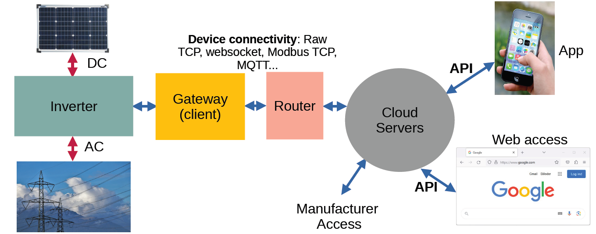

# Solar_Cybersecurity_Requirements
A collection of cybersecurity requirements for connected grid tie solar inverters.

## Scope, Applicability and Definitions

These requirements apply for solar power plants consisting of:
* The solar inverter.
* The gateway. This device - which may be included in the inverter - is the bridge between the cloud (via the home router) and the inverter.
* The cloud platform.
  + At the device's side, it is accessible via specific protocols (e.g. MQTT).
  + At the owner's side, it is accessible via a web client or an app. App security is out of scope.
> [!NOTE]
>  Testing the cloud platform is only partly possible, so that not all requirements can be fully tested.

Notes:
* *must* or *shall* are used for mandatory positive requirements.
* *must not* is used for mandatory negative requirements.
* *may* is an optional requirement or an example of implementation

## Gateway & Inverter

> [!NOTE]
>  The word *device* is used here for gateway and inverter (requirements apply for both). 

### Secure Communication

1. Communication between gateway and cloud shall be protected by TLS version >= 1.2. with enforced mutual authentication.
2. Individual client certificates shall be used on the gateway side.
3. The gateway private key shall be protected (confidentiality) inside the device. This can be done either with a separate secure element or an internal secure enclave inside the processor system.
4. The Root CA of the cloud platform used for server authentication shall be protected (integrity) inside the device. 
5. If a WiFi access point is used for device initialization, it shall implement WPA3 security with **individual** initial password protection.
6. It shall be possible to switch off the Access Point. 
7. If any other wireless communication is used (e.g. Bluetooth), state of the art security shall be implemented.
8. The device must not implement proprietary wireless communication. 

### Authentication and Authorization

1. Accessing or changing **any** device data or parameters shall be protected by a user-password (this applies both for local and remote access).
2. Initial Passwords shall be individual.
3. The user shall be prompted to change the initial password.
4. Password minimum entropy shall be enforced.
5. Password reset shall only be triggered with physical device interaction (e.g. pressing a key on the device).

### Secure Firmware Update

1. Firmware update images shall implement a cryptographic signature.
2. This signature shall be based either on asymmetric cryptography (global key is allowed) or symmetric cryptography (e.g. CMAC) with device-individual key.
3. A rollback protection mechanism shall be implemented.
4. The update image signature shall be checked **before** installing any update.

### Secure Boot

1. CPU and DSP implemented in the devices shall implement secure boot.
2. For devices with internal flash, a separate bootloader shall be used to implement secure boot.
3. For devices without internal flash, CPU / DSP vendor's secure boot mechanisms shall be used.
4. Secure boot shall be based on asymmetric cryptography. Integrity of the code shall be checked **before** it runs on the CPUs/DSPs.
   
### Secure Debugging

1. Any debugging interface (JTAG, UART...) shall be disabled.
2. Re-enabling debugging interfaces shall only be implemented with signed tokens. This token shall include a device individual parameter with enough entropy, so that secure debugging tokens can't be used for all devices.

### Safety Pure Hardware Protection Mechanisms

In case of compromised firmware, following pure hardware circuits shall be implemented:
1. Short circuit protection at the solar **and** grid side
2. Over-heating protection

## Cloud & APIs

### APIs Secure Communication

1. APIs shall only be accessible with TLS >= 1.2.

### Owner Side Authentication & Session Tokens

1. User authentication on the cloud platform may be based on Multi-Factor-Authentication.
2. Password minimum entropy shall be enforced.
3. Session tokens shall have enough entropy. Json Web Tokens may be used.
4. Session tokens shall be invalidated after a predefined time.
5. Session tokens shall be invalidated as soon as a user logs off.

### Device Side Authentication

1. Device authentication shall be based on mTLS (see section Gateway & Inverter > Secure Communication).

### Owner Side API Authorizations

1. **ALL** APIs shall enforce authorization with a valid session token.
2. It shall be ensured, that users can only access resources they are allowed to.
> [!NOTE]
> This requirement is not fully testable.

### Device Side Cloud Authorizations

1. It must be ensured that devices can only access resources which they are allowed to.
2. Access policies shall be implemented on the cloud side (e.g. within the MQTT Broker).

### Remote Control & Remote Maintenance Security

1. Any remote control action on the device shall involve the device individual access password (see section Gateway & Inverter > Authentication and Authorization).
2. Any remote maintenance action shall involve a physical user interaction with the device (e.g. pressing a key). Silent maintenance is forbidden.
   
### OTA Firmware Update

1. It must not be possible to upload a Firmware Update Image on the update file server.
2. A Firmware Update shall only be triggered by device owners or automatically. 

### Security in case of Compromised Servers

1. It shall be ensured that in case of compromised cloud servers, no scalable attacks on a device fleet is possible.
> [!IMPORTANT]
> This is an important requirement. 

## Secure Pairing Process & Factory Reset

1. The pairing process (device + owner) shall involve high entropy credentials (**NOT** a simple serial number!).
2. This pairing process shall only be possible in a local network (**NOT** remotely).
> [!TIP]
> To implement secure pairing, X.509 certificated may be used. A user-certificate may be created and transferred securely (local network) to the device, which will only accept this certificate after the pairing process. End-to-end encryption between device and App may then be implemented using the user-certificate and the device-certificate.
4. Factory reset shall remove / wipe out all user data, including the pairing specific credentials / cryptographic material.

   
